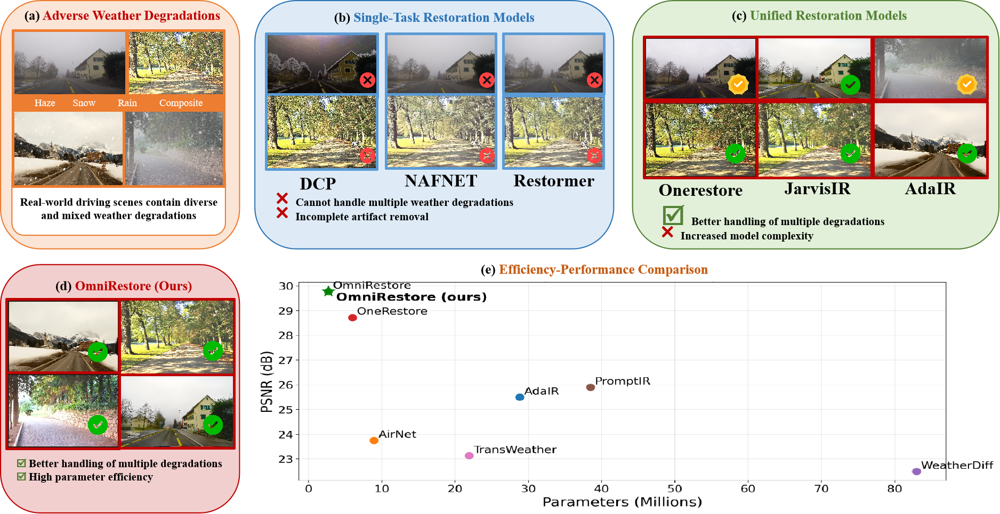
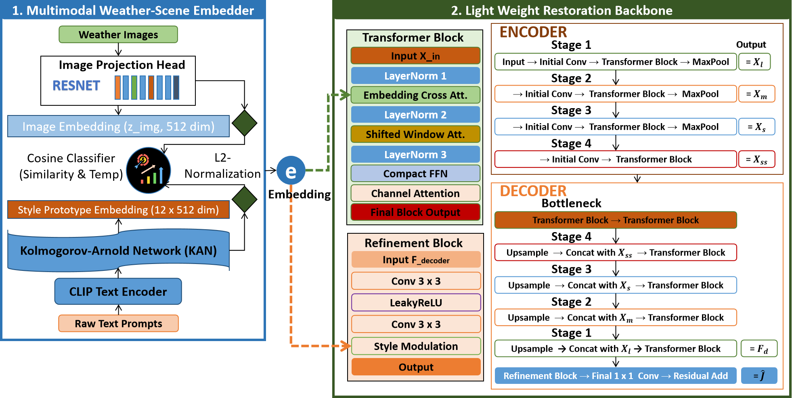
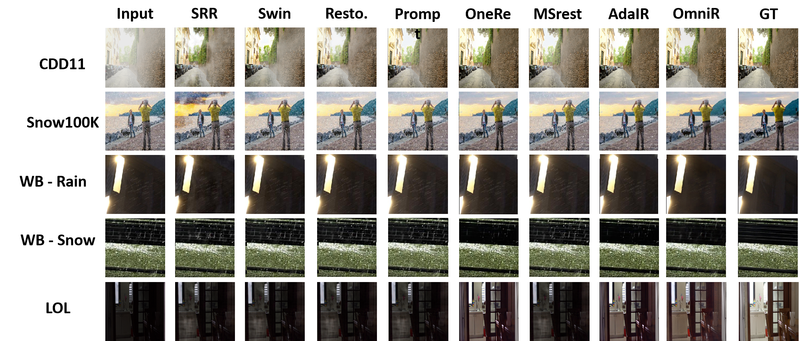

# [CVPRW 2026] OmniRestore: A Parameter-Efficient Framework for Universal Adverse-Weather Image Restoration

[Paper](https://openaccess.thecvf.com/content/CVPR2026W/NTIRE/papers/Njoku_OmniRestore_A_Parameter-Efficient_Framework_for_Universal_Adverse-Weather_Image_Restoration_CVPRW_2026_paper.pdf) | [Supplementary](https://openaccess.thecvf.com/content/CVPR2026W/NTIRE/supplemental/Njoku_OmniRestore_A_Parameter-Efficient_CVPRW_2026_supplemental.pdf) | [Project Page](https://judith989.github.io/CVPRW2026_OmniRestore/) | [Poster](https://judith989.github.io/CVPRW2026_OmniRestore/assets/poster.png) | [LinkedIn](https://www.linkedin.com/in/judith989/)

## OmniRestore: A Parameter-Efficient Framework for Universal Adverse-Weather Image Restoration

**Judith N. Njoku, Diksha Shukla**
Department of Electrical Engineering & Computer Science, University of Wyoming, USA

Accepted to **CVPR 2026 Workshops, NTIRE**.

---


<p align="center">
  
</p>

**Figure 1.** OmniRestore addresses adverse-weather image restoration under rain, snow, fog, low-light, and composite degradations. Compared with single-task restoration models and existing unified restoration frameworks, OmniRestore achieves superior restoration quality while requiring only 2.6M parameters.

---


## Abstract

Reliable perception under adverse weather remains a significant challenge for vision systems. While state-of-the-art multi-weather image restoration models achieve strong performance, they often rely on large architectures with high parameter counts, limiting their utility for real-time and edge deployment. To address this efficiency gap, we propose **OmniRestore**, a lightweight multimodal framework specifically designed for adverse-weather image restoration across rain, fog, snow, low-light conditions, and challenging composite degradations.

OmniRestore consists of two key components: **(i)** a multimodal weather-scene embedder that aligns CLIP-derived text prototypes with image features via a ResNet encoder, refined offline by a Kolmogorov-Arnold Network (KAN) adapter to produce compact, weather-discriminative condition embeddings, and **(ii)** a parameter-efficient restoration backbone that injects these embeddings through hybrid attention blocks integrating embedding-conditioned cross-attention, shifted-window self-attention, and channel recalibration.

Evaluated on **CDD-11**, **Snow100K**, **LOL**, and **WeatherBench**, OmniRestore achieves state-of-the-art restoration fidelity and perceptual quality, outperforming the leading unified restoration framework **OneRestore** by **+1.14 dB PSNR** and **41% in LPIPS** on CDD-11. Notably, OmniRestore requires only **2.6M inference-time parameters**, representing a **56.5% reduction** compared to OneRestore (5.98M), while simultaneously improving restoration quality.

These results demonstrate that accurate universal adverse-weather restoration can be achieved without sacrificing efficiency, making OmniRestore a practical solution for resource-constrained and edge-deployment environments.

---


## News

* **2026.05.29**: Code and pre-trained weights released.
* **2026.05.27**: Project page released.
* **2026.05.15**: OmniRestore published in the CVPR 2026 Workshop Proceedings.
* **2026.04.12**: OmniRestore accepted to CVPR 2026 Workshops.


---

## Highlights

* Universal restoration for rain, fog, snow, low-light, and composite weather degradations.
* Only **2.60M inference-time parameters**.
* **+1.14 dB PSNR** improvement over OneRestore on CDD-11.
* **6.3 ms** per-image inference latency on 256 × 256 inputs.
* CLIP-guided weather semantic conditioning with KAN refinement.
* No text encoder or VLM executed per image during inference.

---

## Network Architecture

<p align="center">
  
</p>

OmniRestore consists of:

1. **Multimodal Weather-Scene Embedder**
   Aligns degraded image features with CLIP-derived weather text prototypes using a ResNet image stream and KAN adapter.

2. **Lightweight Restoration Backbone**
   Uses embedding-conditioned cross-attention, shifted-window self-attention, compact FFN pruning, and channel recalibration.

3. **Adaptive Refinement Stage**
   Applies style modulation using condition-dependent gain and bias parameters to improve perceptual restoration quality.

---

## Qualitative Results

<p align="center">
  
</p>

Qualitative comparison across CDD-11, Snow100K, WeatherBench, and LOL. From left to right: Input, SRResNet, SwinIR, Restormer, PromptIR, OneRestore, M2Restore, AdaIR, OmniRestore, and Ground Truth.

---

## Quick Start

### Installation

```bash
git clone https://github.com/Judith989/omnirestore.git
cd omnirestore

conda create -n omnirestore python=3.10
conda activate omnirestore

pip install torch torchvision torchaudio
pip install timm einops pykan open_clip_torch lpips
pip install pillow numpy matplotlib opencv-python scikit-image pandas scikit-learn tqdm
```

---

## Pre-trained Models

Please place the pre-trained weights in the corresponding folders.

| Model             | Path                                                                                        | Description                              |
| ----------------- | ------------------------------------------------------------------------------------------- | ---------------------------------------- |
| Restoration model | `ckpts/best.ckpt`                                                                           | OmniRestore restoration backbone         |
| Embedder model    | `logs/embedder_resnet18_bs64_optadamw_lr1.00e-05_cw1.0_conw0.1_temp0.07_20260101-190539.pt` | ResNet18 CLIP-KAN weather-scene embedder |

---

## Directory Structure

```text
OmniRestore/
├── ckpts/
│   └── best.ckpt
├── data/
│   └── cdd11/
│       └── splits/
├── logs/
│   └── embedder_resnet18_bs64_optadamw_lr1.00e-05_cw1.0_conw0.1_temp0.07_20260101-190539.pt
├── model/
│   ├── embedder.py
│   ├── wadt_net_shift.py
│   └── wadt_net_no_shift.py
├── utils/
│   ├── dataset_loader.py
│   ├── losses.py
│   └── utils.py
├── eval_embedder.py
├── test_only_images.py
└── test_with_text.py
```

---

## Dataset Preparation

Please prepare the CDD-11 dataset as follows:

```text
data/
└── cdd11/
    ├── train/
    ├── val/
    ├── test/
    └── splits/
```

Additional datasets used for evaluation include:

* Snow100K
* LOL
* WeatherBench

---

## Inference

### 1. Multimodal Restoration, Image + Text

```bash
python test_with_text.py \
    --embedder-model-path logs/embedder_resnet18_bs64_optadamw_lr1.00e-05_cw1.0_conw0.1_temp0.07_20260101-190539.pt \
    --best-ckpt ckpts/best.ckpt \
    --cdd-root path/to/your/cdd11 \
    --output ./results_full_test_with_text \
    --bs 4 \
    --num-works 4 \
    --image-size-h 224 \
    --image-size-w 224
```

### 2. Blind Restoration, Image Only

```bash
python test_only_images.py \
    --embedder-model-path logs/embedder_resnet18_bs64_optadamw_lr1.00e-05_cw1.0_conw0.1_temp0.07_20260101-190539.pt \
    --best-ckpt ckpts/best.ckpt \
    --cdd-root path/to/your/cdd11 \
    --output ./results_full_test_only_images \
    --bs 4 \
    --num-works 4 \
    --image-size-h 224 \
    --image-size-w 224
```

---

## Embedder Evaluation

To evaluate semantic clustering and weather classification accuracy:

```bash
python eval_embedder.py \
    --cdd_test_root path/to/your/cdd11 \
    --checkpoint logs/embedder_resnet18_bs64_optadamw_lr1.00e-05_cw1.0_conw0.1_temp0.07_20260101-190539.pt \
    --emb_out_dir embedder_eval_out \
    --backbone resnet18 \
    --stage 1
```

Depending on your local configuration, run `--stage 1` to extract embeddings and `--stage 2` to compute metrics and generate t-SNE/confusion matrix plots.

---

## Performance

### CDD-11

| Method          | Venue      |    PSNR ↑ |     SSIM ↑ |    Params |
| --------------- | ---------- | --------: | ---------: | --------: |
| OneRestore      | ECCV 2024  |     28.72 |     0.8821 |     5.98M |
| M2Restore       | TIP 2025   |     27.38 |     0.8614 |     47.5M |
| AdaIR           | ICLR 2025  |     28.54 |     0.8779 |    28.77M |
| **OmniRestore** | CVPRW 2026 | **29.86** | **0.9244** | **2.60M** |

### Inference Latency

| Method          |    Params |    Latency |
| --------------- | --------: | ---------: |
| M2Restore       |     47.5M |    95.4 ms |
| AdaIR           |    28.77M |    42.1 ms |
| OneRestore      |     5.98M |    14.2 ms |
| **OmniRestore** | **2.60M** | **6.3 ms** |

---

## Citation

If you find this work useful, please cite:

```bibtex
@InProceedings{Njoku_2026_CVPR,
    author    = {Njoku, Judith and Shukla, Diksha},
    title     = {OmniRestore: A Parameter-Efficient Framework for Universal Adverse-Weather Image Restoration},
    booktitle = {Proceedings of the IEEE/CVF Conference on Computer Vision and Pattern Recognition (CVPR) Workshops},
    month     = {June},
    year      = {2026},
    pages     = {2236--2246}
}
```

---

## Contact

For questions, please contact:

**Judith N. Njoku**
Website: https://www.judithnnjoku.me
LinkedIn: https://www.linkedin.com/in/judith989/
